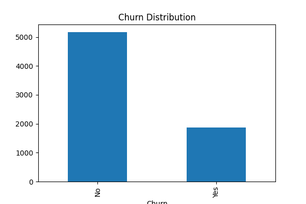
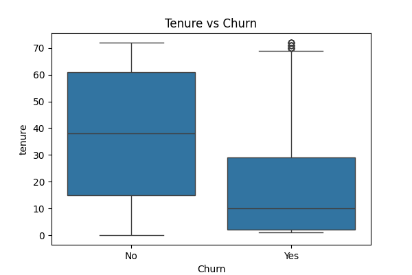
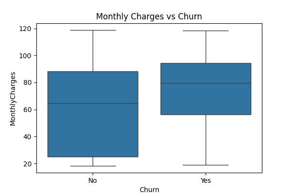
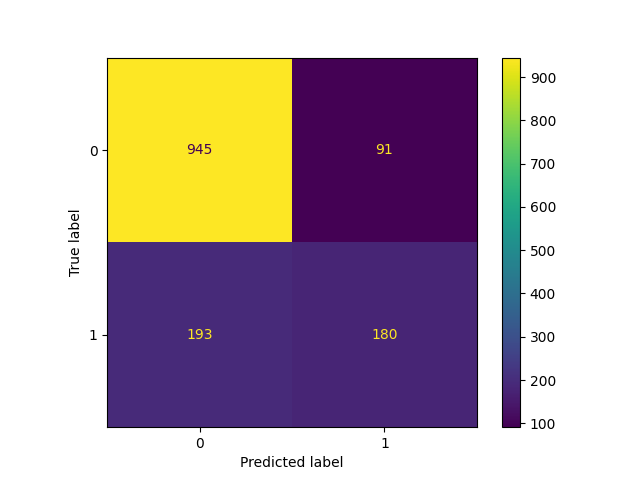
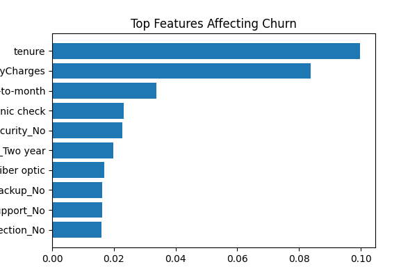

# 📉 Customer Churn Prediction System

### Predicting Customer Retention & Reducing Business Loss

[](https://python.org)
[](https://scikit-learn.org)
[]()
[](https://mysql.com)
[](LICENSE)

<br>

> A machine learning system designed to predict customer churn, identify key churn drivers, and enable proactive retention strategies using data-driven insights.

---

## 📌 Problem Statement

Customer churn is a critical issue for subscription-based and service businesses, directly impacting revenue and long-term growth.

This project addresses:
- Identifying customers likely to churn  
- Understanding key factors influencing churn  
- Enabling data-driven retention strategies  

---

## ✨ Key Features

- 📊 **Churn Prediction Model** — Classifies customers as churn / non-churn  
- 📈 **Feature Importance Analysis** — Identifies key churn drivers  
- 🔍 **Customer Behavior Insights** — Understand patterns behind churn  
- 📉 **Risk Segmentation** — Categorize customers into risk groups  
- 📊 **Model Evaluation Metrics** — Accuracy, Precision, Recall, ROC-AUC  

---

## 🛠️ Tech Stack

| Layer               | Technology                       |
|---------------------|----------------------------------|
| **Data Processing** | Python (Pandas, NumPy)           |
| **Machine Learning**| Scikit-learn, XGBoost            |
| **Data Analysis**   | Jupyter Notebook                 |
| **Visualization**   | Matplotlib                       |
| **Data Querying**   | SQL                              |

---

## 🔄 System Workflow

```text
Raw Customer Data ──► Data Cleaning & Preprocessing
                         │
                         ▼
              Feature Engineering
        (Encoding, Scaling, Transformation)
                         │
                         ▼
              Exploratory Data Analysis
            (Churn Patterns & Trends)
                         │
                         ▼
                Model Training
     (Logistic Regression, Random Forest, XGBoost)
                         │
                         ▼
                Model Evaluation
     (Accuracy, Precision, Recall, ROC-AUC)
                         │
                         ▼
         Feature Importance & Insights
                         │
                         ▼
          Business Recommendations
```

Designed as a modular ML pipeline separating preprocessing, modeling, and evaluation layers.

---

## 📊 Key Insights

### 🔹 Churn Behavior
- Customers with monthly contracts show higher churn rates
- Short tenure customers are more likely to churn

### 🔹 Pricing Impact
- Higher monthly charges correlate with increased churn probability

### 🔹 Service Usage
- Customers with fewer services tend to churn more frequently

### 📈 Model Performance

| Model                 | Accuracy | ROC-AUC |
|-----------------------|----------|---------|
| Logistic Regression   | ~82%     | 0.88    |
| Random Forest         | ~85%     | 0.91    |
| XGBoost               | ~87%     | 0.92    |

## 📊 Visual Insights

### 📉 Churn Distribution


### 📊 Tenure vs Churn


### 💰 Charges vs Churn


### 📉 Confusion Matrix


### 🔍 Feature Importance

### 📌 Key Metrics

- Churn Rate = Customers Lost / Total Customers
- Customer Lifetime Value (CLV)
- Retention Rate
- Prediction Accuracy & Recall

### 💡 Business Recommendations
- Offer discounts or incentives for high-risk customers
- Encourage long-term contracts to reduce churn
- Improve service quality for high-paying customers
- Focus retention campaigns on early-stage customers

---

## 📁 Dataset Description

Dataset includes:

- Customer demographics
- Account information
- Service usage patterns
- Billing details
- Churn label (target variable)

---

## ⚙️ Data Pipeline

1. **Data Ingestion** → Raw dataset loading
2. **Data Cleaning** → Missing values & encoding
3. **Feature Engineering** → Transformations & scaling
4. **Modeling** → ML model training
5. **Evaluation** → Performance metrics & validation

---

## ��️ Getting Started

1. **Clone the Repository**
    ```bash
    git clone https://github.com/your-username/customer-churn-prediction.git
    cd customer-churn-prediction
    ```

2. **Install Dependencies**
    ```bash
    pip install -r requirements.txt
    ```

3. **Run Analysis**
    ```bash
    jupyter notebook
    ```

---

## 📂 Project Structure

```
customer-churn-prediction/
│
├── data/
│   ├── raw/
│   └── processed/
│
├── notebooks/
│   ├── eda.ipynb
│   └── model.ipynb
│
├── pipeline/
│   ├── ingestion.py
│   ├── transformation.py
│   └── model.py
│
├── visuals/
│   ├── churn-distribution.png
│   ├── feature-importance.png
│   └── confusion-matrix.png
│
├── requirements.txt
└── README.md
```

---

## 🔮 Future Enhancements

- Deploy model using Streamlit
- Add real-time churn prediction API
- Integrate customer segmentation models
- Use deep learning for improved accuracy

---

## 👤 Author

Devansh Thakur  
Aspiring Data Engineer | AI/ML

<div align="center">

Customer Churn System © 2026  
Built with Python, ML & Data Analytics

⭐ Star this repo if you found it useful!

</div>
